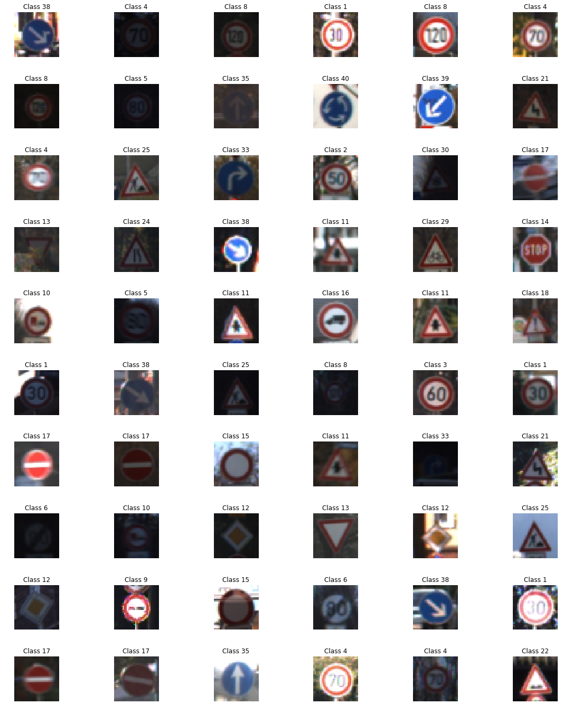
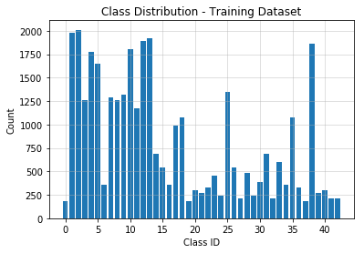
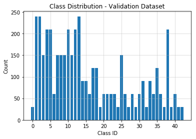
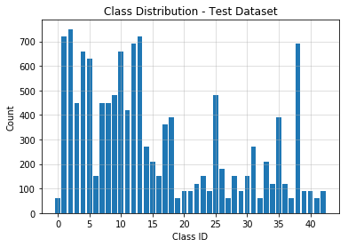
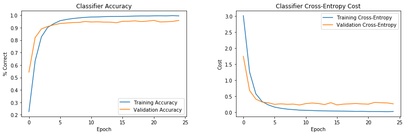
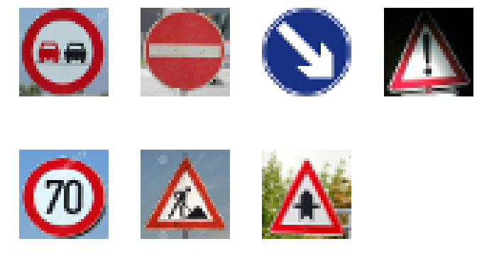
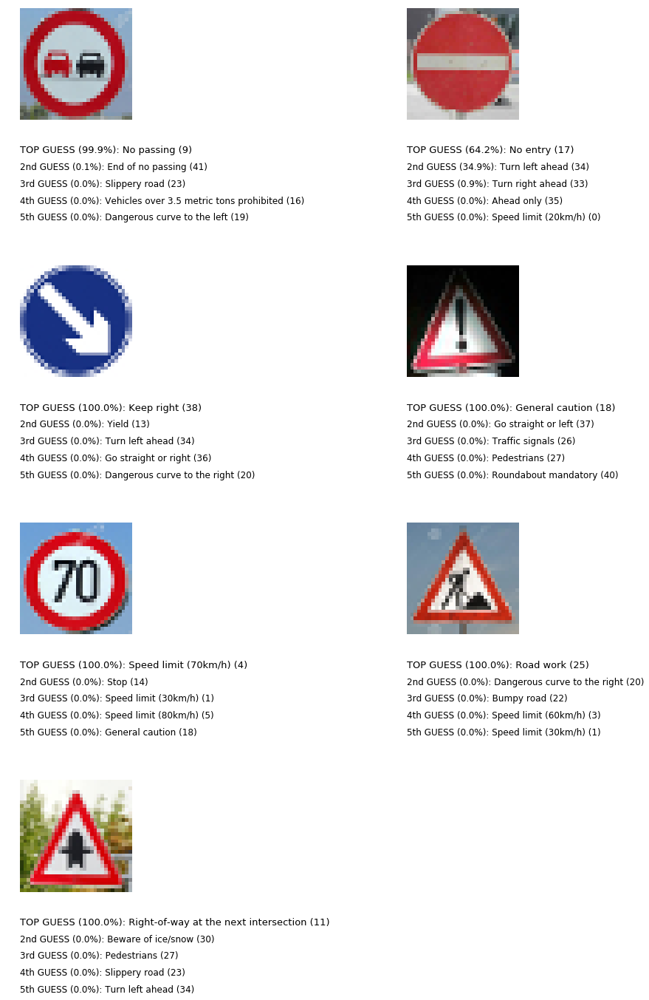
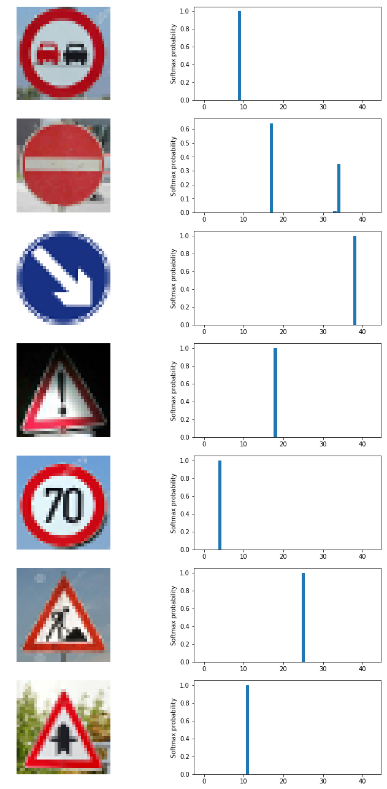

# Traffic Sign Classification

###Build a Traffic Sign Classifier

---

####Goals / Steps:

* Load the data set

* Explore, summarize and visualize the data set

* Design, train and test a model architecture

* Use the model to make predictions on new images

* Analyze the softmax probabilities of the new images

* Summarize the results with a written report

---

### Data Set Summary & Exploration

#### 1. Summary

A brief analysis of the three datasets yields the following:

* The size of training set is 34,799
* The size of the validation set is 4,410
* The size of test set is 12,630
* The shape of a traffic sign image is 32x32x3
* The number of unique classes/labels in the data set is 43

#### 2. Viewing the Dataset

A look at a few random images in the test dataset.

#### 3. Sign Names (Classes)

The complete list of classes by Class ID.

| Class ID | Sign Name                                          |
| -------- | -------------------------------------------------- |
| 0        | Speed limit (20km/h)                               |
| 1        | Speed limit (30km/h)                               |
| 2        | Speed limit (50km/h)                               |
| 3        | Speed limit (60km/h)                               |
| 4        | Speed limit (70km/h)                               |
| 5        | Speed limit (80km/h)                               |
| 6        | End of speed limit (80km/h)                        |
| 7        | Speed limit (100km/h)                              |
| 8        | Speed limit (120km/h)                              |
| 9        | No passing                                         |
| 10       | No passing for vehicles over 3.5 metric tons       |
| 11       | Right-of-way at the next intersection              |
| 12       | Priority road                                      |
| 13       | Yield                                              |
| 14       | Stop                                               |
| 15       | No vehicles                                        |
| 16       | Vehicles over 3.5 metric tons prohibited           |
| 17       | No entry                                           |
| 18       | General caution                                    |
| 19       | Dangerous curve to the left                        |
| 20       | Dangerous curve to the right                       |
| 21       | Double curve                                       |
| 22       | Bumpy road                                         |
| 23       | Slippery road                                      |
| 24       | Road narrows on the right                          |
| 25       | Road work                                          |
| 26       | Traffic signals                                    |
| 27       | Pedestrians                                        |
| 28       | Children crossing                                  |
| 29       | Bicycles crossing                                  |
| 30       | Beware of ice/snow                                 |
| 31       | Wild animals crossing                              |
| 32       | End of all speed and passing limits                |
| 33       | Turn right ahead                                   |
| 34       | Turn left ahead                                    |
| 35       | Ahead only                                         |
| 36       | Go straight or right                               |
| 37       | Go straight or left                                |
| 38       | Keep right                                         |
| 39       | Keep left                                          |
| 40       | Roundabout mandatory                               |
| 41       | End of no passing                                  |
| 42       | End of no passing by vehicles over 3.5 metric tons |

#### 4. Distribution of Training Data

The histogram below shows the distribution of the training, validation and testing datasets across the different classes.

### Design and Test a Model Architecture

#### 1. Image Pre-processing

I decided not to convert my images to grayscale because it seems to me that color information ought to be useful in providing additional features for classification of road signs.  As a result, the LeNet architecture will have to be adjusted to allow for images with a depth of 3 (currently designed for images with a depth of 1).

In the end, the only pre-processing performed on the image was normalization.  This is performed in order to scale all input values from -1.0 to 1.0 which provides the optimizer with a well-conditioned problem which it can easily solve with gradient descent.

#### 2. Model Architecture

My final model consists of 3 convolutional layers, the first two of which use max pooling, followed by 3 fully connected layers with dropout being applied to the first two.  The convolutional layers help to preserve the spatial arrangement of the pixels while the fully connected layers help to provide a sufficient number of neurons to be able to detect and learn features of increased complexities.  In each layer of the convnet, the RELU activation function is used as it is known to be easier to train than the sigmoid activation function.  In the final layer, the Softmax function is used to convert the logits into probabilities.  The setup of the network and it's six layers are described in the figure below.

| Layer         		|     Description	        					|
|:---------------------:|:---------------------------------------------:|
| Input         		| 32x32x3 RGB image   							|
| **xxxxxxxxxx Layer 1 xxxxxxxxxx** | **xxxxxxxxxxxxxxxxxxxxxxxxxxxxxxxxxxxxxxxxxxxxxxxxxx** |
| Convolution 5x5	| 1x1 stride, valid padding, outputs 28x28x24 |
|               RELU                |                  activation function                   |
|          Max Pooling 2x2          |             2x2 stride,  outputs 14x14x24              |
| **xxxxxxxxxx Layer 2 xxxxxxxxxx**	| **xxxxxxxxxxxxxxxxxxxxxxxxxxxxxxxxxxxxxxxxxxxxxxxxxx** |
|          Convolution 5x5          |      1x1 stride, valid padding, outputs 10x10x48       |
|               RELU                |                  activation function                   |
|          Max Pooling 2x2          |              2x2 stride,  outputs 5x5x48               |
| **xxxxxxxxxx Layer 3 xxxxxxxxxx** | **xxxxxxxxxxxxxxxxxxxxxxxxxxxxxxxxxxxxxxxxxxxxxxxxxx** |
|          Convolution 5x5          |       1x1 stride, valid padding, outputs 1x1x128       |
| RELU | activation function |
| **xxxxxxxxxx Layer 4 xxxxxxxxxx** | **xxxxxxxxxxxxxxxxxxxxxxxxxxxxxxxxxxxxxxxxxxxxxxxxxx** |
|          Fully Connected          |                inputs 128, outputs 400                 |
|               RELU                |                  activation function                   |
| Dropout | keep probability 50% |
| **xxxxxxxxxx Layer 5 xxxxxxxxxx** | **xxxxxxxxxxxxxxxxxxxxxxxxxxxxxxxxxxxxxxxxxxxxxxxxxx** |
| Fully Connected | inputs 400, outputs 200 |
|               RELU                |                  activation function                   |
| Dropout | keep probability 50% |
| **xxxxxxxxxx Layer 6 xxxxxxxxxx** | **xxxxxxxxxxxxxxxxxxxxxxxxxxxxxxxxxxxxxxxxxxxxxxxxxx** |
| Fully Connected | inputs 200, outputs 43 |
| Output | 43 logits |

#### 3. Approach Taken

I used a multi-pronged approach to determine the best architecture to use for this problem.  The starting point was the LeNet architecture, but it was clear that this original architecture was not able to be trained to the required accuracy plus it was designed for grayscale images.  Consequently, I expanded the LeNet architecture to allow for color images, more total neurons as well as adding a convolutional layer to further preserve the spatial arrangement or the pixels before flattening the image and runnning through the fully connected layers.

Adding neurons yielded a model that is very easy to train to a high-accuracy but did not fair too well on the validation set.  It appeared that the model was being over-trained (high variance) and so I added a large amount of dropout to the first two of the three fully connected layers.  This technique zeros out a percentage of the neurons with each training sample and forces the network to find additional patterns for detection which, in turn, yields a model which is more robust in its ability to generalize.  When using the model for predictions (and accuracy calculations), dropout is NOT applied and all neurons are used.

While the original LeNet architecture seems to be unable to achieve the required accuracy on the validation set of 93%, my modified LeNet architecture was trained to an accuracy of 95.8% on the same set of data.  

An iterative approach was chosen:

* The LeNet network architecture was used as a starting point.  It was the original design used by Yann LeCun in his 1998 paper and was used to classify handwritten digits from 0 to 9 (grayscale images).  The LeNet architecture was chosen as a starting point for my classifier due to its solid performance in classifying handwritten digits from images.  Convolutional networks are known to work well for image classification problems.    
* The original LeNet architecture was unable to be trained to the degree of accuracy required by the project guidelines.  Over the past twenty years since the LeNet model was published, it has been discovered that adding dropout to the fully connected layers can help to reduce over-training of the model thereby allowing it to generalize better with test sets.
* First of all, the input layer was adjusted to accept images of shape 32x32x3 since we are using RGB images while the LeNet uses grayscale images.  A third convolutional layer was added and a substantial number of neurons were added to the three fully connnected layers.  Additionally, the depths of the filters in each convolution layer were increased.
* Learning rate, number of epochs, dropout rate (or keep probability), number of neurons were then tuned for improved performance.  The idea was to try to train the classifier in as few epochs as possible.  It was found that the technique of adding neurons and applying the dropout technique allow for extremely fast training which the short training cycle helped to reduce over-fitting.

#### 4. Training the Model

To train the model, I used an Adams Optimizer which eliminates the need to use a variable (decaying) learning rate since it handles this internally.  The optimizer was used to determine the weights and biases that minimize the average cross-entropy of the training dataset (class probabilities were determined from the logits using the Softmax function). 

After some fiddling, the following settings seemed to yield good results.

Hyperparameters:

- Learning Rate: 0.0005

- Epochs: 25 

- Batch Size: 128

- Keep Probability: 0.45

The accuracy improved dramatically within the first few training epochs as can be seen in the figure below.  The model trained quickly and training accuracy reached 99.5% while the validation accuracy reached 95.8% after just 30 training epochs.

My final model results were found to be:

- **Training Set Accuracy: 99.5%**

- **Validation Set Accuracy: 95.8%** 

- **Test Set Accuracy: 94.2%** 

### Test the Model on New Images

#### 1. Pick Some Signs

I located several German traffic signs online for testing.  Each of them were cropped and scaled to 32x32 and left in RGB color space in order to standardize them into the same format used for training of this classifier.  These images ought to be fairly easy to classify as each image is taken from head-on, is brightly lit and free of any obstructions with the exception of the last image (the "general caution" sign) which has a small shadow cast on it.     

#### 2. Predictions

For each image, the top five predictions are listed.  In each case, the top/best prediction is close to 100% probability and the others are close to zero.  The exception being the "No Entry" sign which was predicted correctly with a 64% probability.  The numbers in parentheses are the probability of the prediciton and the Class ID.

#### 3. Softmax Probabilities

In each case, the softmax function yielded probabilities of close to 100% for the top choice and close to 0% for each of the remaining classes.  This is good because it is correct in each case.

####4. Result

**The model was able to correctly predict all 7 of the traffic signs shown to it, which gives an accuracy of 100%.**  This is hardly surprising as the accuracy on the test set was shown to be 94.2% and this falls in that range.  The fact that the images used for the test were all well-lit, cropped and viewed from approximately head-on helped the classifier with its task.

